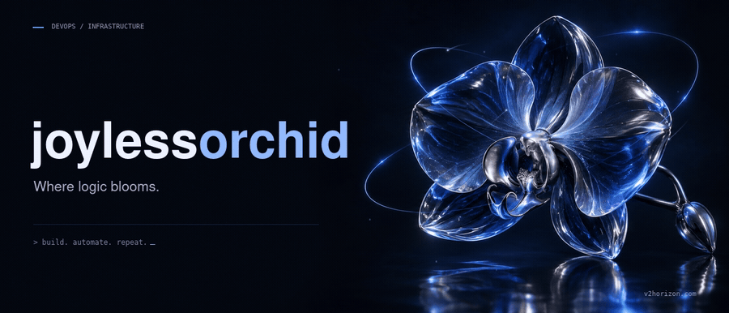

  

**[v2horizon.com](https://v2horizon.com)** &nbsp;·&nbsp;
[GitHub](https://github.com/joylessorchid)

 

I keep live systems running. Around two years of operational work: a Telegram bot in
production with 3,300+ users, a self-hosted Proxmox homelab holding 99% uptime, and the
monitoring that says something is wrong before anyone files a ticket.

Open to junior DevOps and infrastructure roles.

По-русски

 

Держу боевые системы на ходу. Около двух лет операционной работы: Telegram-бот в
проде с 3300+ пользователями, собственный homelab на Proxmox с аптаймом 99% и
мониторинг, который сообщает о проблеме раньше, чем о ней напишут в поддержку.

Открыт к junior-позициям в DevOps и инфраструктуре.

### Stack

| | |
|:--|:--|
| **Infrastructure** | Linux · Proxmox · Docker · Nginx · Caddy |
| **Observability** | Prometheus · Grafana · node_exporter |
| **Data** | PostgreSQL · MariaDB · Redis |
| **Telephony** | Asterisk · FreePBX · SIP |
| **Automation** | n8n · OpenRouter · LLM integrations |

### Selected work

| | Project | What it is | Stack |
|:--|:--|:--|:--|
| 01 | Homelab | Proxmox virtualisation, services in Docker behind Nginx and Caddy, metrics in Grafana. 99% uptime | Proxmox · Docker · Prometheus |
| 02 | Telegram bot | In production, 3,300+ users. Deployment, incident response, changes without downtime | Linux · Docker · LLM APIs |
| 03 | [calendar](https://github.com/joylessorchid/calendar) | Calendar Telegram Mini App, shipped as static build artifacts | JavaScript · static hosting |
| 04 | [portfolio](https://github.com/joylessorchid/portfolio) | [v2horizon.com](https://v2horizon.com) — bilingual EN/RU, dark editorial design, no frameworks | HTML · CSS |
| 05 | [wheel-demo-goldenapple](https://github.com/joylessorchid/wheel-demo-goldenapple) | Promo landing with a spinning prize wheel, no dependencies, ~29 KB total | Vanilla JS |
| 06 | [exam-coach](https://github.com/joylessorchid/exam-coach) | Exam prep site for IIE 09.03.02 | HTML · CSS |

 

The banner is a recording of <a href="https://v2horizon.com">the site</a> — open it for the live version.

